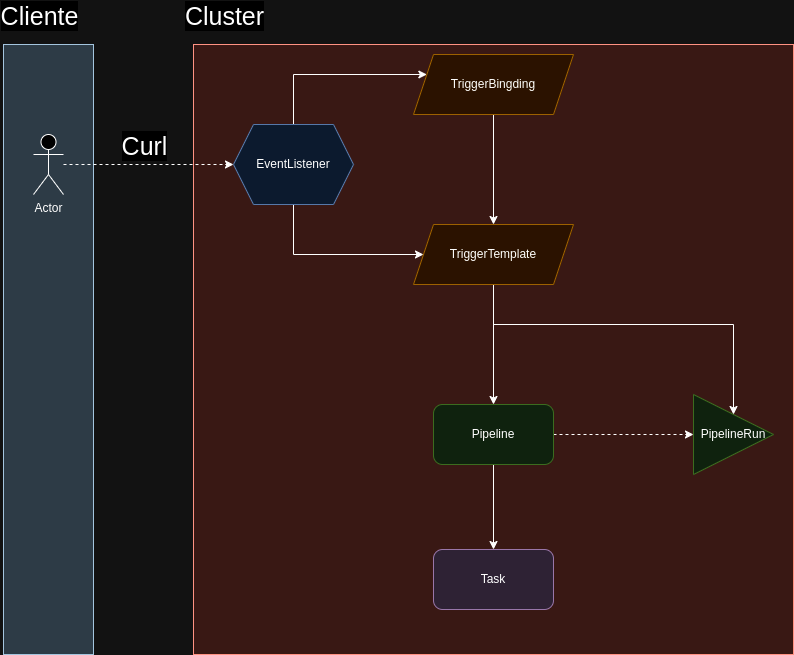

# Ejemplo de tekton para ejecutar con REST

## Pasos a seguir

1. Cargar todos los manifiestos

2. Al cargar el event listener se crea un service llamado *el-{nombre del event listener}*

3. Asegurarse de que se levante un pod que pertenezca al service, ese pod escucha los pedidos
http que le lleguen a la route

4. Ejecutar el siguiente curl:

    ```bash
    curl -v -k -H 'content-Type: application/json' -d '{"who": "Tekton"}' https://el-tekton.apps.ocp01-noprod.ocplasegunda-np.com.ar/
    ```

5. Eso tiene que disparar el pipeline

## Relacion entre los objetos de Tekton


